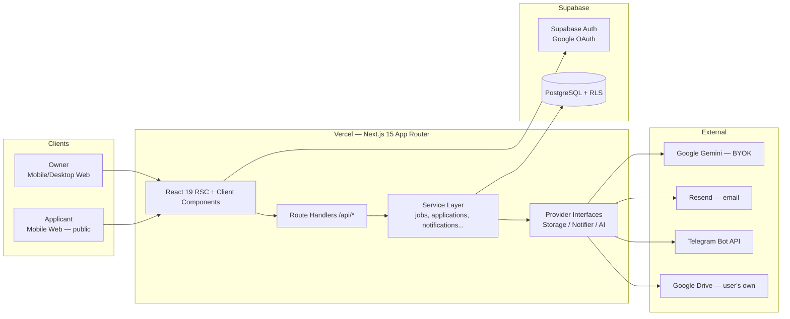

# 03 — System Architecture

> Last updated 2026-08-07. This is the normative source for stack, module boundaries and folder layout. DB specifics: 04. Endpoints: 05.

## 1. System Context



## 2. Technology Decisions (locked)

| Layer             | Choice                                                | Why                                                                 | Alternatives rejected                                               |
| ----------------- | ----------------------------------------------------- | ------------------------------------------------------------------- | ------------------------------------------------------------------- |
| Frontend          | **Next.js 15 (App Router), React 19, Tailwind CSS 4** | RSC for fast public apply pages; one repo for UI+API; Vercel-native | Separate SPA (duplicated infra)                                     |
| Language          | **TypeScript strict**                                 | Reliability at API/DB boundary                                      | —                                                                   |
| Backend           | **Next.js Route Handlers** (`/api/*`)                 | Same deploy, colocation, enough for Phase 1–4                       | Standalone API service (premature)                                  |
| Database          | **PostgreSQL 15 on Supabase**                         | Managed, RLS built in, local dev via Supabase CLI                   | Raw RDS (ops burden), NoSQL (relational domain)                     |
| Auth              | **Supabase Auth, Google-only OAuth**                  | RLS uses `auth.uid()` natively; minimal password surface            | NextAuth roll-your-own (rebuildable later if needed)                |
| Storage (Phase 1) | **User-owned Google Drive** behind `StorageProvider`  | User owns files; zero storage cost; matches product principle       | S3/R2 now (interface makes it a Phase 4 config, not a rewrite)      |
| Email             | **Resend** + react-email templates                    | DX, deliverability, per-email status                                | Raw SMTP                                                            |
| Messaging         | **Telegram Bot API**                                  | Where the target users already are                                  | WhatsApp Business API (cost/approval friction; re-evaluate Phase 4) |
| AI (Phase 3)      | **Gemini (BYOK)** behind `AIProvider`                 | Cheap/free tier for users; provider-swap-ready                      | OpenAI first (kept as future provider impl)                         |
| Validation        | **zod** everywhere (client + server, shared schemas)  | One source of truth                                                 | Hand-rolled checks                                                  |
| Data fetching     | RSC + **TanStack Query** for client interactivity     | Cache + optimistic pipeline moves                                   | SWR (equivalent; one must be chosen)                                |
| Forms             | **react-hook-form + zod resolver**                    | Mobile-friendly controlled inputs                                   | Formik (maintenance)                                                |
| Deployment        | **Vercel** (web) + **Supabase** (db/auth)             | Zero-ops, previews per PR, matches 12                               | Containers (premature)                                              |

**Runtime:** Node 20 LTS, `nodejs` runtime for route handlers that touch Drive/crypto (no edge runtime for crypto/`googleapis`).

## 3. Module Boundaries

The codebase is feature-based (14 §Structure). Cross-feature talking happens **only** through the service layer and provider interfaces:

```
src/
  app/                      # routes only; thin — delegates to services
    (public)/apply/[slug]/  # public apply page
    (auth)/login/
    (app)/dashboard/...     # authenticated app shell
    api/                    # route handlers — validate, call service, shape response
  features/
    jobs/  applications/  applicants/  pipeline/  tags/  notes/
    integrations/  notifications/  ai/  settings/
      <feature>/
        server.ts           # service functions (DB + providers)
        schemas.ts          # zod schemas (shared client/server)
        components/         # feature UI
        hooks.ts            # TanStack Query hooks (if needed)
  lib/
    db.ts                   # supabase server clients (service role vs user JWT)
    env.ts                  # zod-validated env (fail-fast at boot)
    crypto.ts               # AES-256-GCM encrypt/decrypt (D3)
    storage/                # StorageProvider interface + drive impl (+ s3 stub Phase 4)
    notifications/          # NotificationService -> telegram, email impls
    ai/                     # AIProvider interface + gemini impl (Phase 3)
    errors.ts               # AppError + code -> HTTP mapping (05 §Error Model)
    ratelimit.ts            # Upstash-backed fixed window (optional env)
tests/  e2e/
supabase/migrations/
```

**Rules**

1. Route handlers never contain SQL or provider calls — they call `features/*/server.ts`.
2. Only `lib/db.ts` constructs Supabase clients. User-scoped queries use the request-scoped client (RLS enforced); the service-role client is used **only** for: public apply writes, integration callbacks, token refresh — and always with an explicit `owner_id` filter in code.
3. Providers are injected: services receive `StorageProvider`/`NotificationService` instances resolved per-owner from the `integrations` table (`lib/integrations/resolve.ts`).
4. Public apply path must not import any AI code (bundle discipline; AI is Phase 3).

## 4. Provider Interfaces (contracts)

```ts
// lib/storage/types.ts
export interface StorageProvider {
  ensureJobFolder(job: { id: string; title: string }): Promise<{ folderId: string }>
  /** Named child folder — caller caches the id (Phase 5 'AI Screenings' summaries). */
  ensureFolder(name: string, parentId: string): Promise<{ folderId: string }>
  uploadFile(input: {
    folderId: string
    filename: string
    mime: string
    data: Buffer
  }): Promise<{ fileId: string }>
  getFileMetadata(fileId: string): Promise<{ name: string; size: number }>
  deleteFile(fileId: string): Promise<void>
}

// lib/notifications/types.ts
export interface NotificationService {
  notifyOwnerNewApplication(e: NewApplicationEvent): Promise<DeliveryResult> // telegram
  sendApplicantConfirmation(e: ApplicantConfirmation): Promise<DeliveryResult> // email
}
export type DeliveryResult = { ok: true } | { ok: false; code: string; retryable: boolean }

// lib/ai/types.ts (Phase 3)
export interface AIProvider {
  parseResume(text: string): Promise<ParsedResume> // 10 §Prompts — JSON schema
  summarizeApplicant(input: ApplicantContext): Promise<string>
  generateJobDescription(input: JobDraft): Promise<string>
  generateSocialPost(input: JobDraft): Promise<string>
}
```

Provider selection (Phase 1–3): storage = `google_drive` if integration active else `null` (uploads degrade, Flow 4); Phase 4: resolved per-organization (11 §Per-Org Resources).

## 5. Data Flow — New Application (the critical path)

```
Applicant POST /api/apply/:slug
 └─► route handler: ratelimit → zod validate → load job (RLS-bypass service client, owner-scoped)
     └─► applications.service.createWithApplicant()
         ├─ DB tx: upsert applicant → insert application → timeline event
         ├─ if resume: storage.ensureJobFolder → storage.uploadFile → insert resumes row
         │     └─ on throw: resumes.upload_status='failed' + timeline event (NO rethrow)
         └─ notifications.notifyOwnerNewApplication + sendApplicantConfirmation
               └─ fire-and-forget with 1 retry; failures → timeline events
```

Sequencing: the DB transaction commits **before** any external call. External calls are wrapped per-call with try/catch + outcome logging (D4).

## 6. Resilience & Failure Policy (normative)

| Failure                      | Behaviour                                                                                                        |
| ---------------------------- | ---------------------------------------------------------------------------------------------------------------- |
| Drive upload fails           | Application still succeeds; `resumes.upload_status='failed'`; owner Telegram'd; dashboard shows retry affordance |
| Telegram/email fails         | Log + timeline event; retry once; never user-visible to applicant                                                |
| Gemini fails/over quota (P3) | Feature degrades silently; UI offers non-AI path; error logged                                                   |
| DB down                      | 503 error page (owner) / "try again" (applicant) — nothing else we can do                                        |
| Token expired (Drive)        | On-demand refresh (googleapis handles); refresh failure → integration `status='error'` + banner                  |

Background work: Vercel cron (Phase 2+) for nothing critical in Phase 1 — retries are inline. A `/api/cron/reconcile` (Phase 2) cross-checks DB vs Drive to honour G4.

## 7. Security Architecture

- **RLS on every table** (04 §RLS) — defense in depth; server code still scopes queries explicitly.
- **Secrets**: env-only, zod-validated at boot (`lib/env.ts`); user credentials (refresh tokens, bot tokens, AI keys) AES-256-GCM encrypted in DB (`v1.<iv>.<tag>.<ct>` base64) using `ENCRYPTION_SECRET` (32-byte hex).
- **No public resume URLs, ever**: resume view = owner clicks → server fetches a Drive `webViewLink` Drive-scoped link or streams content through `/api/applications/:id/resume` with owner auth check (07 §Access).
- **Public surface**: only `/apply/[slug]`, `POST /api/apply/:slug`, `/login`, auth callbacks. Rate-limited (05 §Rate Limits). Honeypot field on apply form.
- **Headers**: `X-Content-Type-Options`, `X-Frame-Options: DENY` (except none needed), strict `Referrer-Policy`, CSP in Phase 2 hardening.
- **OWASP**: zod on every input; parameterized queries via supabase-js only (no string SQL); MIME sniffed server-side (magic bytes, not extension) for uploaded resumes.

## 8. Environments & Observability

| Env       | Branch      | DB                     | Purpose     |
| --------- | ----------- | ---------------------- | ----------- |
| `dev`     | any local   | Supabase local (CLI)   | Development |
| `preview` | PR branches | shared staging project | PR previews |
| `prod`    | `main`      | production project     | Real users  |

Logging: structured JSON to stdout (Vercel log drain) with `request_id`, `owner_id`, `integration` context. Errors: Sentry (optional, env-gated). Health: `GET /api/health` → `{ ok: true, db: true }`. Full setup: 12 §Environments.

## 9. Scalability Notes (kept honest)

- Phase 1–3 load is trivial (single-region Vercel + Supabase). Bottlenecks will be Drive API quotas (per-user quota — naturally sharded by BYO Drive) and Telegram/Telegram rate limits (30 msg/s global — batch not needed at our scale).
- Phase 4 multi-tenancy changes **query scoping**, not infrastructure (11).
- Migration escape hatches: storage interface → S3; notifier → queues (Inngest/QStash) if retry complexity grows; documented here so future-Me knows it was considered, not required.
