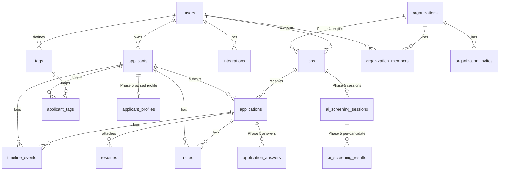

# 04 — Database Design

> Last updated 2026-08-07. Normative. PostgreSQL 15+ on Supabase. All migrations live in `supabase/migrations/` and are applied via Supabase CLI (12 §Migrations).
> Conventions: snake_case · `uuid` PKs = `gen_random_uuid()` · `timestamptz` everywhere · every owned table has `owner_id` (Phase 1–3) **and** nullable `organization_id` (Phase 4 backfill, D5) · RLS enabled on **every** table.

## 1. ERD



## 2. Enums

```sql
create type job_status          as enum ('draft', 'active', 'closed');
create type application_status  as enum ('new','reviewing','shortlisted','interview','offered','hired','rejected','archived');
create type upload_status       as enum ('uploaded','failed');
create type integration_type    as enum ('google_drive','telegram','email','ai');
create type integration_status  as enum ('active','error','disconnected');
create type member_role         as enum ('owner','admin','member');           -- Phase 4
create type timeline_event_type as enum (
  'application_created','status_changed','note_added','tag_added','tag_removed',
  'resume_uploaded','resume_failed','email_sent','email_failed',
  'telegram_sent','telegram_failed','ai_summary_generated','applicant_created'
);
```

## 3. Tables

### 3.1 `users` — profile, mirrors `auth.users`

```sql
create table public.users (
  id                     uuid primary key references auth.users(id) on delete cascade,
  email                  text not null,
  full_name              text,
  avatar_url             text,
  default_organization_id uuid,                     -- Phase 4 FK added in 0006
  workspace_onboarded_at timestamptz,                -- Phase 4 follow-up, added in 0010 (11 §6)
  notify_telegram        boolean not null default true,   -- owner alert toggles (02 §9)
  notify_applicant_email boolean not null default true,
  created_at             timestamptz not null default now(),
  updated_at             timestamptz not null default now()
);
```

Trigger `on_auth_user_created` → `handle_new_user()` inserts the row from auth metadata.

### 3.2 `organizations` — created in v1, activated Phase 4

```sql
create table public.organizations (
  id         uuid primary key default gen_random_uuid(),
  name       text not null check (char_length(name) between 2 and 120),
  slug       text not null unique,                    -- nanoid(10)
  owner_id   uuid not null references public.users(id),
  brand      jsonb not null default '{}'::jsonb,      -- { logo_url, primary_color, email_from_name }
  plan       text not null default 'free' check (plan in ('free','pro','team')),
  created_at timestamptz not null default now(),
  updated_at timestamptz not null default now()
);

create table public.organization_members (
  organization_id uuid not null references public.organizations(id) on delete cascade,
  user_id         uuid not null references public.users(id)       on delete cascade,
  role            member_role not null default 'owner',
  created_at      timestamptz not null default now(),
  primary key (organization_id, user_id)
);

-- Phase 4 (0006): pending seats. Raw tokens never stored — SHA-256 hash only (11 §7).
create table public.organization_invites (
  id              uuid primary key default gen_random_uuid(),
  organization_id uuid not null references public.organizations(id) on delete cascade,
  email           citext not null,
  role            member_role not null default 'member',      -- owner role is never invitable
  token_hash      text not null unique,                       -- sha256 hex of the 24-char nanoid
  invited_by      uuid not null references public.users(id),
  expires_at      timestamptz not null,                       -- created + 7 days
  accepted_at     timestamptz,                                -- single use
  created_at      timestamptz not null default now()
);

-- 0006 also adds: organizations.deleted_at timestamptz (11 §7 soft-delete) and
-- alters users.default_organization_id into a real FK -> organizations(id) on delete set null.
```

### 3.3 `jobs`

```sql
create table public.jobs (
  id              uuid primary key default gen_random_uuid(),
  owner_id        uuid not null references public.users(id) on delete cascade,
  organization_id uuid references public.organizations(id),          -- null = personal workspace
  title           text not null check (char_length(title) between 3 and 120),
  description     text not null default '' check (char_length(description) <= 5000),
  slug            text not null unique,                              -- nanoid(8) a-z0-9
  status          job_status not null default 'draft',
  form_config     jsonb not null default
    '{"phone":"optional","resume":"required","cover_note":"hidden"}'::jsonb,
  drive_folder_id text,                                             -- cached after ensureJobFolder
  created_at      timestamptz not null default now(),
  updated_at      timestamptz not null default now()
);
comment on column public.jobs.form_config is
  'Per-field visibility: each of phone|resume|cover_note = required|optional|hidden. name & email always required.';
```

### 3.4 `applicants` — deduped people (talent pool)

```sql
create table public.applicants (
  id              uuid primary key default gen_random_uuid(),
  owner_id        uuid not null references public.users(id) on delete cascade,
  organization_id uuid references public.organizations(id),
  full_name       text not null check (char_length(full_name) between 2 and 200),
  email           citext not null,                                  -- create extension citext
  phone           text,
  source          text not null default 'direct',                   -- utm/source hint from apply link
  ai_summary      text,                                             -- Phase 3 cache
  created_at      timestamptz not null default now(),
  updated_at      timestamptz not null default now(),
  unique (owner_id, email)
);
```

### 3.5 `applications`

```sql
create table public.applications (
  id             uuid primary key default gen_random_uuid(),
  job_id         uuid not null references public.jobs(id)        on delete cascade,
  applicant_id   uuid not null references public.applicants(id)  on delete cascade,
  status         application_status not null default 'new',
  source_meta    jsonb not null default '{}'::jsonb,             -- { utm_*, referrer, user_agent }
  applied_at     timestamptz not null default now(),
  updated_at     timestamptz not null default now(),
  unique (job_id, applicant_id)                                  -- D8 idempotency
);
```

### 3.6 `resumes` — file references, NOT files (D2)

```sql
create table public.resumes (
  id                uuid primary key default gen_random_uuid(),
  application_id    uuid not null references public.applications(id) on delete cascade,
  applicant_id      uuid not null references public.applicants(id)   on delete cascade,
  storage_provider  text not null default 'google_drive',
  storage_file_id   text,                                            -- Drive file id; null while failed
  original_filename text not null,
  mime_type         text not null,
  size_bytes        integer not null check (size_bytes between 1 and 10485760),  -- ≤ 10 MB
  upload_status     upload_status not null default 'uploaded',
  parsed_text       text,                                            -- Phase 3 extraction cache
  ai_parsed         jsonb,                                           -- Phase 3 ParsedResume
  created_at        timestamptz not null default now()
);
```

### 3.7 `tags` + `applicant_tags` (Phase 2; schema now)

```sql
create table public.tags (
  id              uuid primary key default gen_random_uuid(),
  owner_id        uuid not null references public.users(id) on delete cascade,
  organization_id uuid references public.organizations(id),          -- 0006: team tags (11 §1)
  name            text not null check (char_length(name) between 1 and 40),
  color           text not null default '#6366f1',                   -- hex
  created_at      timestamptz not null default now(),
  unique (owner_id, name)                                            -- personal scope
);
-- 0006 adds partial index for org scope:
--   create unique index tags_org_name_uniq on public.tags (organization_id, lower(name))
--     where organization_id is not null;

create table public.applicant_tags (
  applicant_id uuid not null references public.applicants(id) on delete cascade,
  tag_id       uuid not null references public.tags(id)       on delete cascade,
  created_at   timestamptz not null default now(),
  primary key (applicant_id, tag_id)
);
```

### 3.8 `timeline_events` — unified audit + activity feed

```sql
create table public.timeline_events (
  id             uuid primary key default gen_random_uuid(),
  owner_id       uuid not null references public.users(id) on delete cascade,
  applicant_id   uuid references public.applicants(id)   on delete cascade,
  application_id uuid references public.applications(id) on delete cascade,
  actor_id       uuid references public.users(id),              -- null = system/applicant
  type           timeline_event_type not null,
  payload        jsonb not null default '{}'::jsonb,            -- e.g. status_changed: { from, to }
  created_at     timestamptz not null default now(),
  check (applicant_id is not null or application_id is not null)
);
```

### 3.9 `notes`

```sql
create table public.notes (
  id             uuid primary key default gen_random_uuid(),
  owner_id       uuid not null references public.users(id) on delete cascade,
  applicant_id   uuid not null references public.applicants(id)   on delete cascade,
  application_id uuid references public.applications(id)          on delete cascade,
  author_id      uuid not null references public.users(id),
  body           text not null check (char_length(body) between 1 and 5000),
  created_at     timestamptz not null default now(),
  updated_at     timestamptz not null default now()
);
```

### 3.10 `integrations` — encrypted per-owner connections

```sql
create table public.integrations (
  id                    uuid primary key default gen_random_uuid(),
  owner_id              uuid not null references public.users(id) on delete cascade,
  organization_id       uuid references public.organizations(id),
  type                  integration_type not null,
  status                integration_status not null default 'active',
  credentials_encrypted text,                       -- AES-256-GCM v1.iv.tag.ct (D3); null for config-only
  config                jsonb not null default '{}'::jsonb,       -- e.g. { root_folder_id } or { chat_id }
  created_at            timestamptz not null default now(),
  updated_at            timestamptz not null default now()
);
create unique index integrations_one_active_per_type
  on public.integrations (owner_id, type) where status <> 'disconnected';
```

### 3.11 `settings` — sparse key/value per owner

```sql
create table public.settings (
  id         uuid primary key default gen_random_uuid(),
  owner_id   uuid not null references public.users(id) on delete cascade,
  key        text not null,
  value      jsonb not null,
  updated_at timestamptz not null default now(),
  unique (owner_id, key)
);
```

Known keys: `onboarding.dismissed_drive_banner`, `ui.default_job_view`. Prefer typed columns (like `notify_*` on `users`) for hot settings; this table for sparse prefs.

### 3.12 Phase 5 — Smart Screening (normative, lives in `0007`; behavior in 17)

```sql
-- questionnaires: PRIVATE rules on the job row (never in public form_config — 17 §3.4)
alter table public.jobs add column screening_config jsonb not null default '{"questions":[]}'::jsonb;
-- deterministic verdict, orthogonal to applications.status (17 §2); NULLABLE = "no mandatory questions"
alter table public.applications
  add column screening_status text check (screening_status in ('qualified','does_not_meet_mandatory','review_required'));

create table public.application_answers (           -- candidate PII, one row per question
  id             uuid primary key default gen_random_uuid(),
  application_id uuid not null references public.applications(id) on delete cascade,
  applicant_id   uuid not null references public.applicants(id)    on delete cascade,
  question_id    text not null,                     -- nanoid-6 from screening_config
  answer         jsonb not null,                    -- typed payload per question type
  created_at     timestamptz not null default now(),
  unique (application_id, question_id)
);

create table public.applicant_profiles (            -- parse-v2 cache (17 §6), 1:1 with applicant
  applicant_id      uuid primary key references public.applicants(id) on delete cascade,
  payload           jsonb not null,                 -- ResumeProfileSchema
  source_resume_id  uuid references public.resumes(id) on delete set null,
  prompt_version    text not null,
  updated_at        timestamptz not null default now()
);

create table public.ai_screening_sessions (         -- append-only history (17 §7)
  id             uuid primary key default gen_random_uuid(),
  job_id         uuid not null references public.jobs(id) on delete cascade,
  owner_id       uuid not null references public.users(id),       -- creator (workspace ref via job)
  organization_id uuid references public.organizations(id),       -- denormalized from job for RLS/indexes
  pool           text not null check (pool in ('qualified','review_required','qualified_review','all_non_archived')),
  instruction    text not null check (char_length(instruction) between 3 and 2000),
  max_results    integer not null check (max_results between 1 and 100),
  provider       text not null default 'gemini',
  model          text not null,
  prompt_version text not null,
  engine         text not null default 'interactive' check (engine in ('interactive','batch')),
  engine_ref     text,                             -- e.g. Gemini batch job resource name
  status         text not null default 'queued' check (status in ('queued','processing','completed','failed','cancelled','quota_limited')),
  pool_size      integer not null default 0,
  processed      integer not null default 0,
  failed         integer not null default 0,
  started_at     timestamptz,
  completed_at   timestamptz,
  created_at     timestamptz not null default now()
  -- 0008+: locked_at (§9.1 processing lease); 0009+: summary_folder_id/summary_file_id (17 §13 Drive artifact)
);

create table public.ai_screening_results (          -- retry unit = one row (17 §9.3)
  id             uuid primary key default gen_random_uuid(),
  session_id     uuid not null references public.ai_screening_sessions(id) on delete cascade,
  application_id uuid not null references public.applications(id) on delete cascade,
  applicant_id   uuid not null references public.applicants(id)   on delete cascade,
  status         text not null default 'pending' check (status in ('pending','ok','failed')),
  error          text,
  rank           integer,
  category       text check (category in ('strong_match','possible_match','review_required','lower_priority')),
  score          smallint check (score between 0 and 100),        -- AI prioritization score (17 §8.1), NOT a probability
  reasons        jsonb not null default '[]'::jsonb,
  evidence       jsonb not null default '[]'::jsonb,
  uncertainties  jsonb not null default '[]'::jsonb,
  created_at     timestamptz not null default now(),
  unique (session_id, application_id)
);

create index answers_application_idx        on public.application_answers (application_id);
create index applications_job_screening_idx on public.applications (job_id, screening_status);
create index screening_sessions_job_idx     on public.ai_screening_sessions (job_id, created_at desc);
create index screening_results_session_idx  on public.ai_screening_results (session_id, status, rank);
```

## 4. Indexes & Search

```sql
create index jobs_owner_status_idx        on public.jobs (owner_id, status);
create index applicants_owner_email_idx   on public.applicants (owner_id, email);
create index applications_job_status_idx  on public.applications (job_id, status);
create index applications_applicant_idx   on public.applications (applicant_id);
create index applications_owner_feed_idx  on public.applications (applied_at desc);  -- feed
create index resumes_application_idx      on public.resumes (application_id);
create index timeline_app_idx             on public.timeline_events (application_id, created_at desc);
create index timeline_applicant_idx       on public.timeline_events (applicant_id, created_at desc);
create index notes_applicant_idx          on public.notes (applicant_id);

-- Phase 2 free-text search (13 has perf test): trigram
create extension if not exists pg_trgm;
create index applicants_search_trgm on public.applicants using gin ((full_name || ' ' || email) gin_trgm_ops);

-- Phase 4 (0006): org talent-pool dedupe (11 §6) + org-scoped listing support
create unique index applicants_org_email_uniq on public.applicants (organization_id, email)
  where organization_id is not null;
create index jobs_org_status_idx        on public.jobs (organization_id, status) where organization_id is not null;
create index applicants_org_created_idx on public.applicants (organization_id, created_at desc) where organization_id is not null;
create index integrations_org_type_idx  on public.integrations (organization_id, type) where organization_id is not null;
```

## 5. Triggers

```sql
-- updated_at maintenance
create or replace function public.set_updated_at() returns trigger language plpgsql as $$
begin new.updated_at = now(); return new; end $$;
-- applied to: users, jobs, applicants, applications, notes, integrations, settings

-- new auth user -> profile
create or replace function public.handle_new_user() returns trigger
language plpgsql security definer set search_path = public as $$
begin
  insert into public.users (id, email, full_name, avatar_url)
  values (new.id, new.email,
          new.raw_user_meta_data->>'full_name',
          new.raw_user_meta_data->>'avatar_url')
  on conflict (id) do nothing;
  return new; end $$;
create trigger on_auth_user_created after insert on auth.users
  for each row execute procedure public.handle_new_user();
```

## 6. Row-Level Security (normative policy set)

Phase 1–3 identity rule: **a row is visible iff `owner_id = auth.uid()`** (tables without `owner_id` join up: `resumes`/`timeline_events`/`notes`/`applicant_tags` via parent `applications`/`applicants`). Phase 4 adds org-membership policies alongside (11 §5) — written as additive policies, no rewrites, gated through one helper:

```sql
-- 0006: avoids policy recursion on organization_members and makes soft-delete inert (11 §7).
create function public.current_org_role(org uuid) returns member_role
language sql stable security definer set search_path = public as $$
  select m.role from public.organization_members m
    join public.organizations o on o.id = m.organization_id
  where m.organization_id = org and m.user_id = auth.uid() and o.deleted_at is null
$$;
```

Phase 4 policy set (in `0006`, all additive): `*_org_member for all` on `jobs`, `applicants`, `tags`, `applicant_tags` (parent join), `applications`+`resumes` (job join), `notes` (applicant join — insert requires `owner_id = auth.uid()`); `integrations_org_manage` = `current_org_role in ('owner','admin')` for writes + member read; `timeline_events_org_read` (select only — writes stay owner-scoped); `organizations_admin_update` / invites policies (`members.manage`); RPC `lookup_invite(token)` + `accept_org_invite(token)` (security definer) so org routes never need the service-role client (03 §Rules).

```sql
alter table public.users         enable row level security;
alter table public.jobs          enable row level security;   -- ... every table

-- representative policies (full set lives in supabase/migrations/0004_rls_and_triggers.sql)
create policy users_self      on public.users        for all using (id = auth.uid()) with check (id = auth.uid());
create policy jobs_owner      on public.jobs         for all using (owner_id = auth.uid()) with check (owner_id = auth.uid());
create policy applicants_owner on public.applicants  for all using (owner_id = auth.uid()) with check (owner_id = auth.uid());
create policy applications_owner on public.applications
  for all using (exists (select 1 from public.jobs j where j.id = job_id and j.owner_id = auth.uid()));
-- public apply writes bypass RLS via the service-role client ONLY inside /api/apply/:slug (03 §Rules)
```

Read access to `jobs` for the **public apply page** is done server-side with the service client selecting exactly `(id, title, description, form_config, status)` by slug — never via anon RLS, so job drafts stay private.

Phase 5 policy set (in `0007`, additive, same pattern): `answers_*` on `application_answers` (owner via `applicant_id→applicants.owner_id` + org via `current_org_role(applicants.organization_id)`; service-role insert on public apply); `applicant_profiles` (owner/org via applicants join); `ai_screening_sessions` (owner via jobs join owner_id + org via its denormalized `organization_id` and `current_org_role`); `ai_screening_results` (join through session). All four `enable row level security` (17 §10).

## 7. Migration Plan

| File                                | Contents                                                                                                                                                                                                                                                                                                                          | Phase |
| ----------------------------------- | --------------------------------------------------------------------------------------------------------------------------------------------------------------------------------------------------------------------------------------------------------------------------------------------------------------------------------- | ----- |
| `0001_extensions_enums.sql`         | extensions (pgcrypto, citext, pg_trgm), enums                                                                                                                                                                                                                                                                                     | 0     |
| `0002_core_tables.sql`              | §3 tables + constraints + `set_updated_at`                                                                                                                                                                                                                                                                                        | 0     |
| `0003_indexes.sql`                  | §4 indexes                                                                                                                                                                                                                                                                                                                        | 0     |
| `0004_rls_and_triggers.sql`         | §6 full policy set + `handle_new_user`                                                                                                                                                                                                                                                                                            | 0     |
| `0005_phase2_indexes.sql`           | `notes_applicant_idx`, GIN trigram `applicants_search_trgm` on `applicants(full_name \|\| ' ' \|\| email)`, `timeline_event_type` gains `'application_deleted'` — additive only (deferred from the original seed-migration plan; `supabase/seed.sql` is a standalone no-op that runs on every `db reset`, see its header comment) | 2     |
| `0006_phase4_orgs.sql`              | Phase 4 activation: `organization_invites`, `organizations.deleted_at`, FK `users.default_organization_id`, `tags.organization_id`, org indexes, `current_org_role`/`lookup_invite`/`accept_org_invite` fns, additive org RLS policies, idempotent personal-org backfill (data rows untouched)                                    | 4     |
| `0007_phase5_screening.sql`         | Phase 5 (17): `jobs.screening_config`, `applications.screening_status`, `application_answers`, `applicant_profiles`, `ai_screening_sessions`, `ai_screening_results`, +indexes +RLS — additive only, backfills nothing                                                                                                            | 5     |
| `0008_phase5_screening_async.sql`   | Phase 5.4 (17 §9): `ai_screening_sessions.locked_at` processing lease (CAS claim / quota cooldown / crash reclamation) + partial active-session index for the worker poll — additive only                                                                                                                                         | 5     |
| `0009_phase5_screening_summary.sql` | Phase 5.5 (17 §13): `ai_screening_sessions.summary_folder_id` + `summary_file_id` — immutable Drive summary artifact per completed session (write-once), additive only                                                                                                                                                            | 5     |
| `0010_workspace_chooser.sql`        | Phase 4 follow-up (11 §6): `users.workspace_onboarded_at`, backfilled for users who already had an explicit `default_organization_id`; `accept_org_invite` re-created to also stamp it — additive only, backfills nothing that wasn't already an explicit choice                                                                  | 4     |

**No destructive migrations without a paired backup note in CHANGELOG.** Enum extensions use `alter type ... add value` (non-reversible — flagged in PR).

## 8. Data Lifecycle & Compliance

- **Deletion:** deleting an application cascades `resumes` rows + `timeline_events` + `notes` (DB). Drive file persists in owner's Drive (documented, 07 §Deletion). Account deletion removes all owned rows + encrypted credentials via cascades.
- **PII minimisation:** only name/email/phone/resume stored. `parsed_text`/`ai_parsed` (Phase 3) are PII-bearing → same deletion guarantees; never logged. Phase 5 additions `application_answers` + `applicant_profiles` are likewise PII-bearing: cascades ride on `applications`/`applicants` (account deletion purges them), never logged, never in public payloads.
- **Reconciliation (G4):** Phase 2 cron `/api/cron/reconcile` samples Drive files vs `resumes.storage_file_id` and alerts on mismatch.

## 9. Sizing Assumptions

10k applications + 10k resume rows ≈ < 20 MB of DB metadata. Everything fits comfortably in the Supabase free tier through Phase 2; Phase 4 introduces per-plan limits (11 §Plans) before parsed-text storage grows meaningfully.
